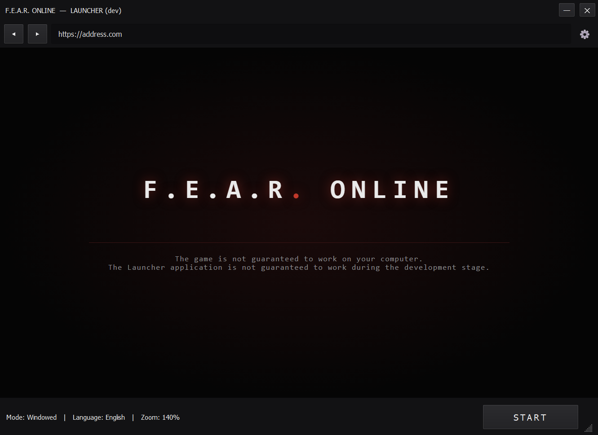
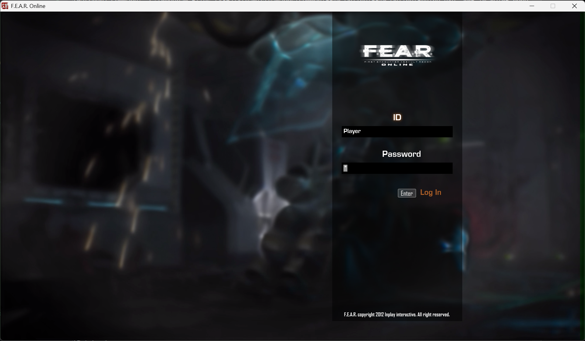
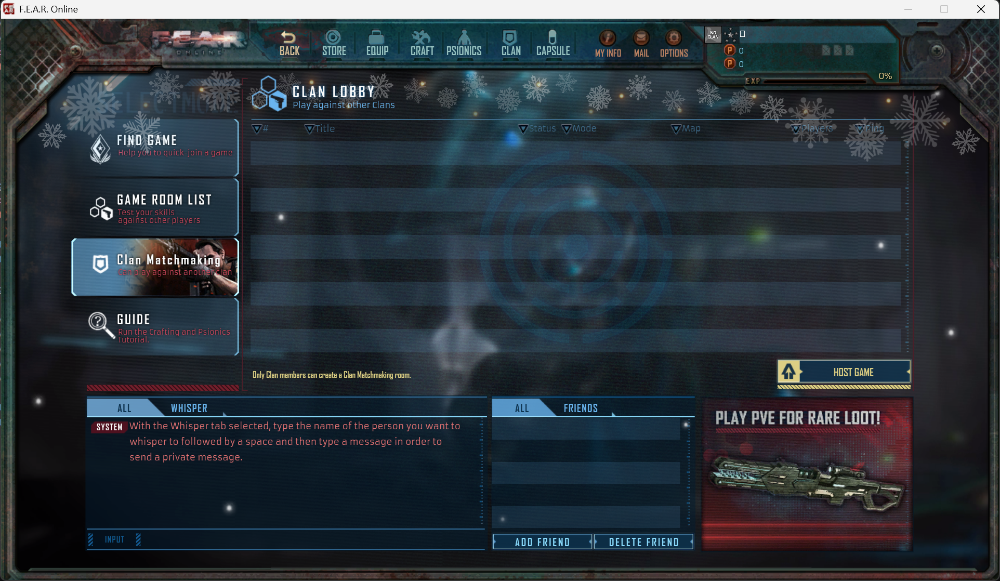

# F.E.A.R. Online — Reverse Engineering Notes
## Status: Not working yet.

Notes on analyzing authentication and client startup for F.E.A.R. Online
(Steam release, published by Aeria Games) for the purpose of standing up
a private server.

- **Steam App ID:** 223650 (only available via direct link)
- Install: `Win+R` → `steam://install/223650/` (includes DLC)

---

## Tools

| Tool | Purpose |
|---|---|
| [**DebugView**](https://learn.microsoft.com/ru-ru/sysinternals/downloads/debugview) | New ZNetwork.dll debug |
| [**Wireshark**](https://www.wireshark.org/) | Deeper inspection of outgoing requests |
| [**Ghidra**](https://github.com/NationalSecurityAgency/ghidra/releases) | String search, disassembly, and decompilation of functions |
| [**x32dbg**](https://x64dbg.com/) | Step-by-step debugging, breakpoints, call stack, memory values, DLL load log and function call tracing |
| **Python** | Log Server and Launcher |

---

## New Launcher (In progress)






| Login: Player |
| Password: 1234567890 |



### GameClient.dll Global Variables

The patcher modifies the following global variables in `GameClient.dll`:

| Variable | Offset | Description |
|----------|--------|-------------|
| `g_bMonolithMultiplayerFinalBuild` | 0x248A4 | Final build flag |
| `g_bMonolithMultiplayerIsRanked` | 0x23FFC | Ranked match flag |
| `g_nMonolithMenuNumUsers` | 0x2264C | Number of users |
| `g_nMonolithMenuUserMyIndex` | 0x227CC | Current user index |
| `g_nMonolithMultiplayerMyServerState` | 0x2BA38 | Server connection state |
| `g_nMonolithMultiplayerMyLevel` | 0x258F8 | Player level |
| `g_nMonolithMultiplayerMyUserGrade` | 0x25928 | Player grade |
| `g_nMonolithMultiplayerHangarMyPoint` | 0x2A57C | In-game currency |
| `g_nMonolithMultiplayerHangarMyCash` | 0x2A5B0 | Cash currency |
| `g_bMonolithMultiplayerClearTutorial` | 0x2BA6C | Tutorial completion flag |
| `g_nMonolithMultiplayerLoginWin_PVP` | 0x24F4C | PVP wins |
| `g_nMonolithMultiplayerLoginDraw_PVP` | 0x24F80 | PVP draws |
| `g_nMonolithMultiplayerLoginLose_PVP` | 0x24FB4 | PVP losses |
| `g_nMonolithMultiplayerLoginWin_PVE` | 0x24FE8 | PVE wins |
| `g_nMonolithMultiplayerLoginLose_PVE` | 0x2501C | PVE losses |
| `g_nMonolithSystemLayerPlatform` | 0x3892C | Platform type (PC) |
| `g_nMonolithGlobalLanguage` | 0x2108C | Language (English) |
| `g_bMonolithGlobalIsCollectorsEdition` | 0x21050 | Collectors edition flag |

---

## Registry

The engine reads/writes a registry key:

```
HKEY_CURRENT_USER\SOFTWARE\FOO Productions\F.E.A.R. Online\1.00.0000
Value: USERID
```

This is used to build a local path like
`%LOCALAPPDATA%\InPlay Interactive\<USERID>\` for **local save/user
data** — not a network authentication mechanism. This value has not
appeared locally yet, presumably because the OAuth flow is currently
breaking before `Launcher.exe` gets a chance to write it.

---

## Engine.exe

- Loads **GameClient.dll** — this is where command-line arguments are
  validated, and where traces of Steam authentication live.
- **Argument syntax is `+key value`** (not `-key=value`).

### Confirmed working command line

The following full parameter set was reconstructed from the command-line
builder inside `Launcher.exe` (`FUN_0048f700`) and confirmed to work by
direct test: the game launches and reaches an actual TCP connection
attempt to `LoginServerIP:LoginServerPort` (i.e. it passes every
command-line validation check inside `GameClient.dll`).

```
"C:\Program Files (x86)\Steam\steamapps\common\FEAR Online\FEAR_Online\Engine.exe" +PB IN +UIPB none +BANNER 0 +UID test123 +LauncherID 1 +windowed 1 +Lan en +LoginServerIP 127.0.0.1 +LoginServerPort 30003
```

| Parameter | Meaning / notes |
|---|---|
| `PB` | Likely a region/publisher code. Confirmed working value: `IN`. Other known values: `AE`, `NO`, `WI`. |
| `UIPB` | Unclear purpose. Tested with `none`; corresponds to a config field that was empty (`UIPB=""`) in the original launcher config. |
| `BANNER` | Unclear purpose. Hardcoded to `1` inside `Launcher.exe`. |
| `UID` | Likely the user's unique account ID. Passed into the command-line builder from an external parameter (`param_2`) — presumably comes from the server response after successful authentication. Tested with an arbitrary placeholder value. |
| `LauncherID` | Unclear purpose. Built via `wsprintfW` from an internal numeric field in `Launcher.exe`. |
| `windowed` | Windowed mode, `1`/`0`. |
| `Lan` | Localization/language code. Set to `en`. |
| `LoginServerIP` | Login server IP address. |
| `LoginServerPort` | Login server port. Default/tested value: `30003`. |

### Parameter validation order at startup

1. `+PB` is checked first.
   - If the key is **missing entirely** → dialog **"Please Excute 'Launch FEAROnline.exe'"** → `PostQuitMessage`.
   - If the key is **present but its value fails a later check** → dialog **"Wrong Argument!"**.
2. The value `IN` **passes** the initial string comparison, but a
   **region-specific validator function** is then called, which can
   still reject it → "Wrong Argument!" again.

### Findings from decompiled functions (GameClient.dll, via Ghidra)

- **Dialog dispatch function** — the routine that ultimately shows both
  "Please Excute..." and "Wrong Argument!" reads the `PB` value and
  compares it against four known codes: `"IN"`, `"AE"`, `"NO"`, `"WI"`.
  Each code has its own dedicated validator function; only if that
  validator succeeds does startup continue past this stage.
- **Region "AE" validator** — after matching `"AE"`, this function checks
  an `"OnSteam"` flag and, if true, reads a `"SteamID"` parameter (via
  the exact same command-line getter used for `PB`), then compares it
  against something via a separate helper. If this comparison fails, the
  user sees "Please Execute Steam client and steam login" and the
  process quits. This strongly suggests `SteamID` is also expected to be
  supplied as a command-line parameter by the launcher (not yet
  confirmed experimentally).
- **LoginServerIP / LoginServerPort reader** — reads both parameters
  through the same getter mechanism, with explicit debug logging calls
  (`"Program Run Command Argu - Not Exist LoginServerIP"`,
  `"...Invalid Info LoginServerPort"`, etc.). It's unclear yet whether
  this logging goes to a file (`enginemsg.txt`, seen in the strings
  dump) or only to `OutputDebugString`; no such log file has been found
  locally yet.
- **CSV server-list parser** — looks for either a built-in archive
  resource named `c3.Arch01` or, as a fallback, a file at
  `./CSV/EtcInfo.csv` with columns: `Index, GameServerIP,
  GameServerPort, Language, EventKey, AcceptChannel`. This file is
  currently missing from the install and will be needed once the
  authentication/login-server stage is resolved. Exact delimiter/row
  format not yet confirmed.
- **Local user-data path builder** — combines `%LOCALAPPDATA%\InPlay
  Interactive\` with the `USERID` registry value (see above) to build a
  save-data folder path. Confirmed this is unrelated to network
  authentication.

---

## ZNetwork.dll

A separate DLL of interest — its exports contain every in-game player
action. These are likely hooked to in-game events elsewhere, in the
`.exe` or another DLL.

There are traces of ProudNet, but the SDK version is unknown.

---

## Engine.exe command-line syntax — trial results

Tested experimentally via x32dbg (breakpoint on the `call eax` inside
`GameClient.dll` that performs the parameter lookup, then inspecting the
`EAX` register after the call):

| Syntax tried | Result |
|---|---|
| `-PB=IN` | Not found (EAX = 0) |
| `-PB IN` | Not found (EAX = 0) |
| `-PB PB_NoOverride` | Not found (EAX = 0) |
| `PB IN` (no prefix) | Not found (EAX = 0) |
| **`+PB IN`** | **Found** (EAX ≠ 0), value `"IN"` matches the string in code |

**Conclusion: the correct syntax is `+key value`.**

With `+PB IN` alone, the "Please Excute..." dialog changed to **"Wrong
Argument!"**, confirming the key is found and the value `IN` is
recognized, but that in isolation the additional region-specific
validator was not satisfied.

**Update:** once the full parameter set reconstructed from
`Launcher.exe`'s command-line builder was used (see "Confirmed working
command line" above), the game launched successfully and reached a real
TCP connection attempt on `LoginServerIP:LoginServerPort`. The earlier
"Wrong Argument!" was therefore caused by missing parameters
(`UID`, `LauncherID`, `Lan`, etc.), not by an invalid `PB` value.

---

# New ZNetwork.dll

DLL injection method.
Install Visual Studio (the Community Edition is free) with the Desktop development with C++ workload. Make sure the x86 (Win32) target is installed—not just x64.
Open the "x86 Native Tools Command Prompt for VS 2022" (search for it in the Start menu). Be sure to use the x86 prompt, not x64 or x64_x86.

## Compile the DLL:

Open "x86 Native Tools Command Prompt for VS 2022"

```
cd C:\path\to\root\ZNetwork_new
build.bat
```

# EXE/DLL Tree

```
[C:\PROGRAM FILES (X86)\STEAM\STEAMAPPS\COMMON\FEAR ONLINE](docs/tree.md)
|== aeria_launcher.exe
|== Aeria_web.ico
|== Compare2Requisite.lst
|== F.E.A.R. Online Website.URL
|== fearonline_install.ico
|== Get Aeria Points.URL
|== [Launcher.exe](docs/Launcher.exe.md)
|== Launcher.ini
|== sdkencryptedappticket.dll
|== steam_api.dll
|== steam_appid.txt
|== Uninst.exe
|== [ZAeria.dll](docs/ZAeria.dll.md)
|== [ZLauncher.dll](docs/ZLauncher.dll.md)
|== 
+---FEAR_Online
|== |== AssertWin32DLL.dll
|== |== AssertWin32DLLU.dll
|== |== binkw32.dll
|== |== dbghelp.dll
|== |== DumpGen.exe
|== |== eax.dll
|== |== [Engine.exe](docs/Engine.exe.md)
|== |== Game.ini
|== |== GameDatabase.dll
|== |== GameDefinitionFile.dll
|== |== LTMemory.dll
|== |== Monolith.PropertyGrid.v1.0.dll
|== |== Monolith.PropertyGrid.v1.0D.dll
|== |== Monolith.PropertyGrid.v1.0U.dll
|== |== Monolith.PropertyGrid.v1.0UD.dll
|== |== PerformanceMon.dll
|== |== sdkencryptedappticket.dll
|== |== SecuromPaul.dll
|== |== steam_api.dll
|== |== StringEditRuntime.dll
|== |== symsrv.dll
|== |== 
|== +---CSV
|== |== ==  OptionPatchList.csv
|== |
|== +---Game
|== |== |== ClientFx.fxd
|== |== |== ClientSession_MH.dll
|== |== |== dbghelp.dll
|== |== |== [GameClient.dll](docs/GameClient.dll.md)
|== |== |== [GameServer.dll](docs/GameServer.dll.md)
|== |== |== interface.bndl
|== |== |== SKU.cfg
|== |== |== SKULowViolence.cfg
|== |== |== Version.cfg
|== |== |== [ZNetwork.dll](docs/ZNetwork.dll.md)
L---LauncherData
|==|==||== [Config.xml](docs/Config.xml.md)
|==|==||== ZAeria.dll
|==|==||== 
|==|==+---Language
|==|==||== +---common
|==|==||== ||==|==|== bg.bmp
|==|==||== ||==|==|== bgm.wav
|==|==||== ||==|==|== BG_launcher_bottom.bmp
|==|==||== ||==|==|== BG_launcher_top.bmp
|==|==||== ||==|==|== BtnClose.bmp
|==|==||== ||==|==|== btnDownClose.wav
|==|==||== ||==|==|== btnDownMinimize.wav
|==|==||== ||==|==|== btnDownStart.wav
|==|==||== ||==|==|== BtnMinimize.bmp
|==|==||== ||==|==|== btnOver.wav
|==|==||== ||==|==|== btnOverClose.wav
|==|==||== ||==|==|== btnOverMenu.wav
|==|==||== ||==|==|== btnOverMinimize.wav
|==|==||== ||==|==|== btnOverStart.wav
|==|==||== ||==|==|== btnOverStart01.wav
|==|==||== ||==|==|== btnOverStart02.wav
|==|==||== ||==|==|== btnOverStart03.wav
|==|==||== ||==|==|== btnStart.bmp
|==|==||== ||==|==|== BTN_check.bmp
|==|==||== ||==|==|== BTN_close.bmp
|==|==||== ||==|==|== BTN_minimize.bmp
|==|==||== ||==|==|== BTN_notice.BMP
|==|==||== ||==|==|== BTN_soundOFF.bmp
|==|==||== ||==|==|== BTN_soundON.bmp
|==|==||== ||==|==|== BTN_start.bmp
|==|==||== ||==|==|== BTN_support.bmp
|==|==||== ||==|==|== gauge_independent.bmp
|==|==||== ||==|==|== gauge_total.bmp
|==|==||== ||==|==|== 
|==|==||== +---en
|==|==||== ||==|==|== Text.xml
|==|==||== ||==|==|== 
|==|==||== +---ko
|==|==||== ||==|==|== Text.xml
|==|==||== ||==|==|== 
|==|==||== +---kr
|==|==||== ||==|==|== Text.xml
|==|==||== ||==|==|== 
|==|==||== L---th
|==|==||==|==|==|==|== Text.xml
|==|==||==|==|==|==|== 
|==|==L---Temp
|==|==|==|==|==|==Config.xml
|==|==|==|==|==|==ContentsList.xml
|==|==|==|==|==|==DeleteList.xml
|==|==|==|==|==|==Language.pd
|==|==|==|==|==|==Launcher.exe
|==|==|==|==|==|==PrerequisiteList.xml
|==|==|==|==|==|==sdkencryptedappticket.dll
|==|==|==|==|==|==steam_api.dll
|==|==|==|==|==|==steam_appid.txt
|==|==|==|==|==|==ZLauncher.dll
```
